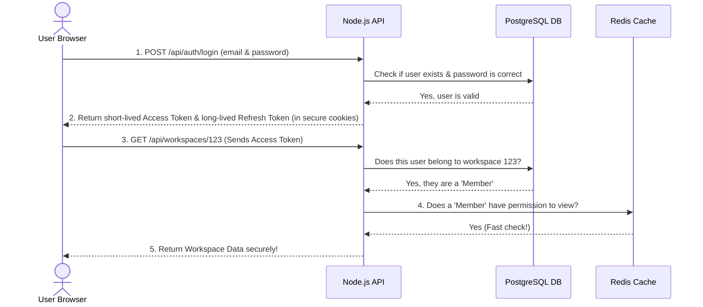

# NimbusAuth API

NimbusAuth is a modern, secure Backend API built to handle **Authentication** (logging users in) and **Multi-Tenancy** (letting users group together into Workspaces or Organizations). 

This project is built using Node.js, Express, PostgreSQL, and Redis. It is designed following enterprise security best practices so that it can be safely used in real-world applications.

---

## 📖 Core Concepts (For Beginners)

If you are new to backend development, you will hear a lot of jargon. Let's break down exactly what this API does in simple terms.

### 1. Authentication vs Authorization
- **Authentication** answers the question: *"Who are you?"* (e.g. You log in with your email and password, and the server verifies your identity).
- **Authorization** answers the question: *"What are you allowed to do?"* (e.g. You are logged in, but are you allowed to delete this workspace? No, because you are only a 'viewer', not an 'owner').

### 2. What is Multi-Tenancy?
Imagine an apartment building. The building is the software, and the apartments are the **Tenants**. Each tenant has their own locks, their own furniture, and their own privacy. 
In our API, a "Tenant" is called a **Workspace**. Users can create a workspace, invite other users to join it, and share data securely without other workspaces being able to see it.

### 3. How do we keep you logged in safely? (Tokens)
Instead of asking for your password on every single request, the API gives you a digital "VIP wristband" called an **Access Token**. You show this wristband to the server to prove who you are.

However, if someone steals your wristband, they could pretend to be you! To fix this, we make the wristband expire very quickly (every 15 minutes). 
But we don't want you to have to log in every 15 minutes. So, we also give your browser a hidden **Refresh Token**. When your 15-minute wristband expires, your browser secretly uses the Refresh Token to ask the server for a new wristband.

---

## 🧩 Architecture Diagram

Here is a visual map of how a user interacts with the system, gets their tokens, and accesses an isolated workspace:



---

## 🛠️ Tech Stack
- **Node.js & Express.js**: The core web server.
- **PostgreSQL**: The main database where users and workspaces are permanently stored.
- **Drizzle ORM**: The tool we use to interact with the database using JavaScript instead of raw SQL.
- **Redis**: An ultra-fast temporary database used for caching permissions to speed up requests.
- **Docker**: Used to spin up the database and Redis instantly on any computer.

## 🚀 Getting Started

1. Ensure you have Docker and Node.js installed.
2. Clone the repository and install dependencies:
   ```bash
   npm install
   ```
3. Start the Docker containers (Database and Redis):
   ```bash
   docker compose -f docker-compose.dev.yml up -d
   ```
4. Push the database schema:
   ```bash
   npx drizzle-kit push
   ```
5. Start the API server:
   ```bash
   npm run dev
   ```

The API will be available at `http://localhost:3000`. You can visit `http://localhost:3000/api/docs` to view the interactive Swagger documentation!
