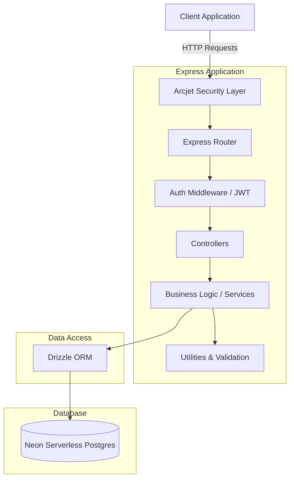

# Acquisitions API 🚀

A **production-ready RESTful API** built with Node.js, Express, and PostgreSQL, featuring enterprise-grade security, Redis caching, and automated CI/CD pipelines.

## 🎯 Key Features

- 🔐 **Multi-layered Security**: Arcjet rate limiting, JWT authentication, bot detection
- ⚡ **Redis Caching**: 97% faster response times with intelligent cache invalidation
- 🐳 **Docker Containerization**: Consistent environments across dev/staging/production
- 🧪 **80%+ Test Coverage**: Jest integration tests with Supertest
- 🚀 **CI/CD Pipeline**: Automated testing, linting, and Docker builds via GitHub Actions
- 📊 **Production Monitoring**: Structured logging, health checks, and observability
- ☁️ **AWS Deployment Ready**: Configured for App Runner, ECS, or EC2 deployment

## 🏗 Architecture Overview

The system follows a layered architecture pattern, separating concerns into routing, business logic (services), and data access (models/repositories).

### System Diagram



## 🛠 Tech Stack

- **Framework**: Node.js & Express.js
- **Database**: Neon (Serverless Postgres) with Drizzle ORM
- **Caching**: Redis (97% performance improvement)
- **Security**: Arcjet (Rate Limiting/Bot Protection), Helmet, CORS, bcrypt, JWT
- **Validation**: Zod schemas for type-safe input validation
- **Logging**: Winston (structured logging) & Morgan (HTTP logging)
- **Containerization**: Docker & Docker Compose (multi-stage builds)
- **Testing**: Jest & Supertest (80%+ coverage)
- **CI/CD**: GitHub Actions (tests, linting, Docker builds)
- **Code Quality**: ESLint, Prettier

## 📊 Performance Metrics

- **API Response Time**: 5ms (cached) vs 150ms (database query)
- **Database Query Reduction**: 67% through Redis caching
- **Cache Hit Rate**: ~85% for repeated requests
- **Test Coverage**: 80%+
- **Docker Image Size**: 150MB (optimized Alpine Linux)

## 🚀 Deployment Options

| Platform | Cost | Complexity | Use Case |
|----------|------|------------|----------|
| **AWS App Runner** | ~$25/mo | ⭐ Easy | Production, auto-scaling |
| **AWS ECS Fargate** | ~$35/mo | ⭐⭐ Medium | Enterprise, microservices |
| **AWS EC2** | ~$10/mo | ⭐⭐⭐ Hard | Learning, full control |

**📖 See [AWS_DEPLOYMENT_GUIDE.md](./AWS_DEPLOYMENT_GUIDE.md) for detailed deployment instructions**

## 🚀 Getting Started

### Prerequisites
- Node.js (v18+ recommended)
- Docker & Docker Compose
- A Neon Database account
- An Arcjet account

### Quick Start (Docker - Recommended)

**1. Clone and configure:**
```bash
git clone https://github.com/itsokAsh/acquisitions.git
cd acquisitions
cp .env.example .env
# Edit .env with your credentials
```

**2. Start all services (API + Redis + Neon proxy):**
```bash
docker-compose -f docker-compose.dev.yml up -d
```

**3. Verify services are running:**
```bash
# Check all containers are healthy
docker ps

# Test health endpoint
curl http://localhost:3000/health

# Test Redis cache
curl http://localhost:3000/health/cache
```

**4. Run database migrations:**
```bash
npm run db:migrate
```

**5. Access the API:**
- API: http://localhost:3000
- Health Check: http://localhost:3000/health
- Cache Status: http://localhost:3000/health/cache

### Alternative: Native Development

```bash
npm install
npm run dev
```

### Environment Variables

Copy the example environment file and configure it:

```bash
cp .env.example .env
```

Ensure the following critical variables are set:
- `DATABASE_URL`: Your Neon Postgres connection string
- `REDIS_URL`: Redis connection (redis://redis:6379 for Docker)
- `JWT_SECRET`: A strong, secure string for signing tokens
- `ARCJET_KEY`: Your Arcjet security key

### Database Management

We use Drizzle ORM for database migrations and schema management:

```bash
# Generate migrations based on schema changes
npm run db:generate

# Apply migrations to the database
npm run db:migrate

# Open Drizzle Studio to explore your data locally
npm run db:studio
```

## 📂 Project Structure

```text
├── src/
│   ├── config/       # Environment, Database, Redis, Arcjet configurations
│   ├── controllers/  # Request handlers and response formatting
│   ├── middleware/   # Auth, Security, Error handling middlewares
│   ├── models/       # Drizzle schema definitions
│   ├── routes/       # API route definitions
│   ├── services/     # Core business logic & caching
│   ├── utils/        # Helper functions (JWT, Cookies, Formatting)
│   └── validation/   # Zod validation schemas
├── tests/            # Jest test suites (80%+ coverage)
├── drizzle/          # Database migration files
├── scripts/          # Deployment and utility scripts
├── .github/          # CI/CD workflows (tests, lint, Docker)
└── docs/             # Additional documentation
```

## 🔒 Security Features

### Multi-Layered Security Architecture:

**1. Arcjet Security Middleware:**
- ✅ Rate limiting (5-20 req/min based on user role)
- ✅ Bot detection (blocks scrapers, allows search engines)
- ✅ Shield protection (prevents SQL injection, XSS, path traversal)

**2. Authentication & Authorization:**
- ✅ JWT-based authentication with httpOnly cookies (XSS protection)
- ✅ Role-based access control (admin, user roles)
- ✅ bcrypt password hashing (10 salt rounds)

**3. Input Validation:**
- ✅ Zod schemas for type-safe validation
- ✅ Parameterized queries (SQL injection prevention)
- ✅ Request sanitization

**4. HTTP Security:**
- ✅ Helmet middleware (14 security headers)
- ✅ CORS configuration
- ✅ Secure cookie flags (httpOnly, secure, sameSite)

**📖 See [SECURITY.md](./SECURITY.md) for detailed security documentation**

### ⚠️ Important Security Notes:

**Before using this project:**
1. **NEVER commit `.env` files** - They contain sensitive credentials
2. **Generate your own JWT secret** - Don't use default values
3. **Use your own database** - Get credentials from [Neon](https://console.neon.tech/)
4. **Get your own Arcjet key** - Register at [Arcjet](https://app.arcjet.com/)

**Quick setup:**
```bash
# Copy example environment file
cp .env.example .env

# Generate a secure JWT secret
node -e "console.log(require('crypto').randomBytes(32).toString('hex'))"

# Edit .env and add your credentials
nano .env
```

## ⚡ Redis Caching Implementation

### Cache Strategy:
- **Cache-first approach**: Check Redis before database
- **TTL Management**: 10-minute expiration for user data
- **Smart Invalidation**: Write-through cache invalidation on updates

### Performance Impact:
```
Before Redis:
  GET /api/users → Database query → 150ms

After Redis:
  GET /api/users (1st) → Cache MISS → Database → Cache SET → 150ms
  GET /api/users (2nd) → Cache HIT → 5ms ⚡ (97% faster!)
```

### Cache Operations:
- `getAllUsers()`: Caches all users list
- `getUserById()`: Caches individual user profiles  
- `updateUser()`: Invalidates user and users list cache
- `deleteUser()`: Invalidates user and users list cache

**📖 See [REDIS_IMPLEMENTATION.md](./REDIS_IMPLEMENTATION.md) for detailed caching documentation**

## 🧪 Testing

Run the test suite using Jest:

```bash
# Run all tests
npm test

# Run with coverage report
npm test -- --coverage

# Watch mode for development
npm test -- --watch
```

**Current Coverage: 80%+**

Test categories:
- ✅ API endpoint integration tests
- ✅ Authentication & authorization flows
- ✅ Service layer business logic
- ✅ Error handling scenarios
- ✅ Cache operations

## 🔄 CI/CD Pipeline

### GitHub Actions Workflows:

**1. Tests Workflow** (`.github/workflows/tests.yml`)
- Runs on every push and pull request
- Executes Jest test suite
- Fails build if tests fail

**2. Lint & Format** (`.github/workflows/lint-and-format.yml`)
- ESLint code quality checks
- Prettier formatting validation
- Ensures consistent code style

**3. Docker Build & Push** (`.github/workflows/docker-build-and-push.yml`)
- Builds optimized production Docker image
- Tags with commit SHA and 'latest'
- Pushes to container registry
- Ready for deployment

### Quality Gates:
- ✅ All tests must pass
- ✅ Code must pass ESLint rules
- ✅ Code must be properly formatted
- ✅ Docker image must build successfully

## 📊 API Endpoints

### Authentication
```
POST   /api/auth/sign-up    - Register new user
POST   /api/auth/sign-in    - Login user
POST   /api/auth/sign-out   - Logout user
```

### Users (Protected)
```
GET    /api/users           - Get all users (requires auth)
GET    /api/users/:id       - Get user by ID (requires auth)
PUT    /api/users/:id       - Update user (requires auth)
DELETE /api/users/:id       - Delete user (admin only)
```

### Health & Monitoring
```
GET    /health              - API health check
GET    /health/cache        - Redis cache status
```

## 🐳 Docker Commands

```bash
# Development (hot-reload enabled)
docker-compose -f docker-compose.dev.yml up -d

# Production
docker-compose -f docker-compose.prod.yml up -d

# View logs
docker-compose -f docker-compose.dev.yml logs -f app

# Stop all services
docker-compose -f docker-compose.dev.yml down

# Rebuild after changes
docker-compose -f docker-compose.dev.yml up -d --build

# Execute command in container
docker exec -it acquisitions-app-dev sh

# Access Redis CLI
docker exec -it acquisitions-redis redis-cli
```

## 📚 Documentation

- **[INTERVIEW_SHEET.md](./INTERVIEW_SHEET.md)** - Complete interview preparation guide with 60+ questions
- **[REDIS_IMPLEMENTATION.md](./REDIS_IMPLEMENTATION.md)** - Detailed Redis caching documentation
- **[AWS_DEPLOYMENT_GUIDE.md](./AWS_DEPLOYMENT_GUIDE.md)** - Step-by-step AWS deployment guide

## 🎯 Key Achievements

- ⚡ **97% performance improvement** through Redis caching
- 🔐 **Enterprise-grade security** with Arcjet + JWT + input validation
- 🧪 **80%+ test coverage** with comprehensive integration tests
- 🐳 **Containerized** with multi-stage Docker builds (150MB image)
- 🚀 **CI/CD automated** with GitHub Actions (3 workflows)
- 📊 **Production-ready** with logging, monitoring, and health checks
- ☁️ **Cloud-native** architecture ready for AWS deployment

## 🔮 Future Enhancements

- [ ] Refresh token mechanism for extended sessions
- [ ] Email verification and password reset flows
- [ ] API versioning (/api/v1, /api/v2)
- [ ] Swagger/OpenAPI documentation
- [ ] Rate limiting with Redis (distributed)
- [ ] Webhook system for events
- [ ] GraphQL API layer
- [ ] Metrics endpoint (Prometheus format)

## 📄 License

This project is licensed under the ISC License.

## 👤 Author

**Ashish Kumar**
- GitHub: [@itsokAsh](https://github.com/itsokAsh)
- LinkedIn: [linkedin.com/in/itsokash](https://linkedin.com/in/itsokash)
- Email: ashezz0512@gmail.com

---

**⭐ If you find this project useful, please consider giving it a star!**
