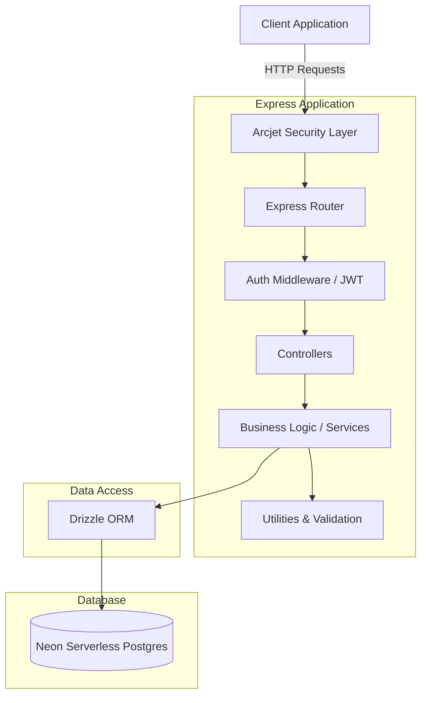

# Acquisitions API 🚀

A robust, production-ready RESTful API built with Node.js and Express, designed with a focus on security, performance, and developer experience.

## 🏗 Architecture Overview

The system follows a layered architecture pattern, separating concerns into routing, business logic (services), and data access (models/repositories). It leverages modern serverless Postgres (Neon) with Drizzle ORM for type-safe database interactions. Security is a first-class citizen, utilizing Arcjet for rate limiting and bot protection, alongside standard JWT-based authentication.

### System Diagram



## 🛠 Tech Stack

- **Framework**: Node.js & Express.js
- **Database**: Neon (Serverless Postgres)
- **ORM**: Drizzle ORM
- **Security**: Arcjet (Rate Limiting/Protection), Helmet, CORS, bcrypt, JWT
- **Validation**: Zod
- **Logging**: Winston & Morgan
- **Containerization**: Docker & Docker Compose
- **Testing**: Jest & Supertest
- **Code Quality**: ESLint, Prettier

## 🚀 Getting Started

### Prerequisites
- Node.js (v18+ recommended)
- Docker & Docker Compose
- A Neon Database account
- An Arcjet account

### Environment Variables

Copy the example environment file and configure it:

```bash
cp .env.example .env
```

Ensure the following critical variables are set:
- `DATABASE_URL`: Your Neon Postgres connection string.
- `JWT_SECRET`: A strong, secure string for signing tokens.
- `ARCJET_KEY`: Your Arcjet security key.

### Local Development (Docker Recommended)

The easiest way to run the application locally is via Docker:

```bash
# Start the development server with hot-reload
npm run dev:docker
```

Alternatively, to run it natively:

```bash
npm install
npm run dev
```

### Database Management

We use Drizzle ORM for database migrations and schema management:

```bash
# Generate migrations based on schema changes
npm run db:generate

# Apply migrations to the database
npm run db:migrate

# Open Drizzle Studio to explore your data locally
npm run db:studio
```

## 📂 Project Structure

```text
├── src/
│   ├── config/       # Environment, Database, Arcjet configurations
│   ├── controllers/  # Request handlers and response formatting
│   ├── middleware/   # Express middlewares (Auth, Error handling)
│   ├── models/       # Drizzle schema definitions
│   ├── routes/       # API route definitions
│   ├── services/     # Core business logic
│   ├── utils/        # Helper functions, JWT, Cookies
│   └── validation/   # Zod validation schemas
├── tests/            # Jest test suites
├── drizzle/          # Drizzle migration files
├── scripts/          # Docker and deployment shell scripts
└── Dockerfile        # Container definition
```

## 🧪 Testing

Run the test suite using Jest:

```bash
npm test
```
